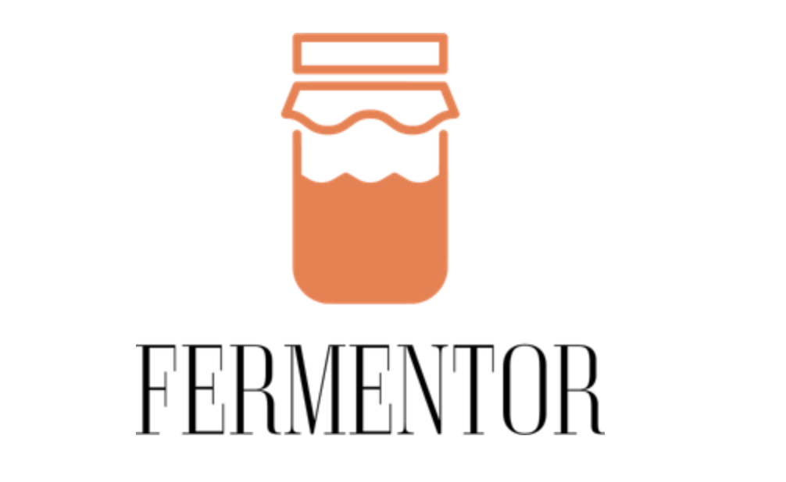
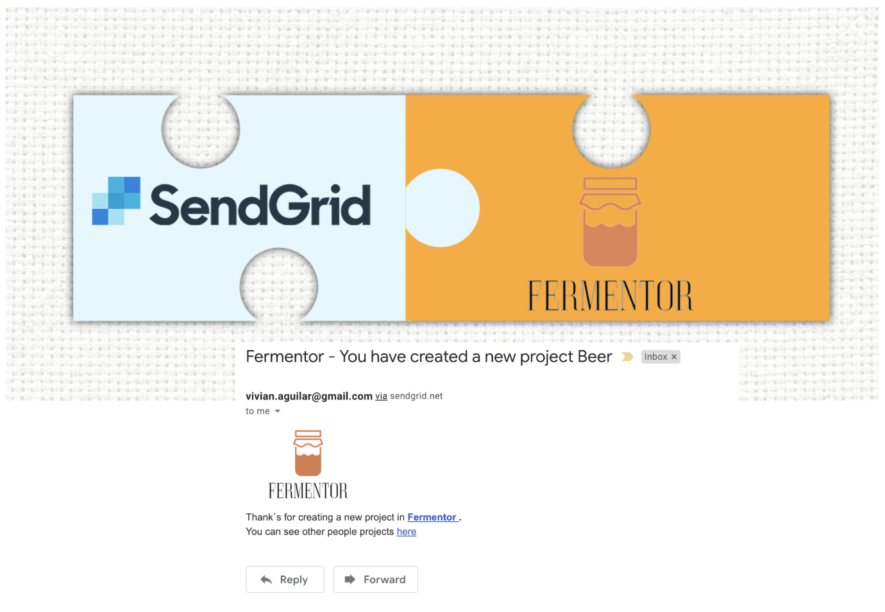
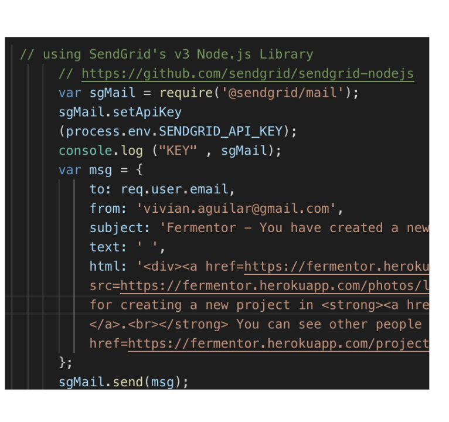
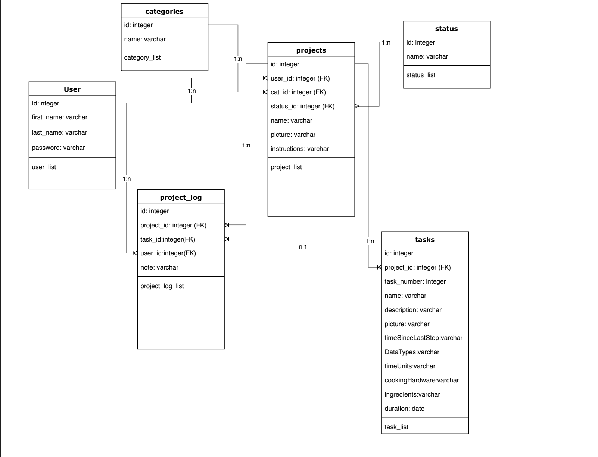
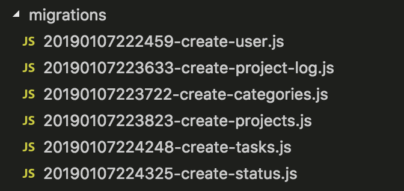

# Welcome to FerMentor!

 
# Your Electronic Fermentation Guide

## Overview
 FerMentor is an electronic fermentation guide that allows users to create an account, view fermentation guides, follow the recipes to create your own fermentation projects, as well as publishing your very own fermentation recepies. Our overall concept for the creation of this app was to build a platform and a community where people who are interested in learning how to ferment can start. For example, a person who wants to learn the craft of fermentation but has no idea how to start, FerMentor would be a helpful tool because as a beginner in fermentation we give you the tool to make notes as you make progress in your own fermentation process. We also thought of FerMentor as a good platform for people who are masters at fermenting to be able to publish their own fermentation guides and allow others users to see and follow.
 
 To create FerMentor we employed Node.js, JSON, HTML, CSS, JavaScript, Express, Mysql workbench, handlebars and to deploy our app we used Heroku.

 ### Getting Started

  Users are only able to view all the recipes available in our database and also publish their own if they have a FerMentor account. We used bcrypt for our password hashing function, with the use of simple database authentication, each request makes a call to the database to match a user with an authentication token. The use of bcrypt allowed us to create our user Sign Up/ Log In authentication. 

(Giphy about registering and loggin in)

After user has successfully created a FerMentor account, they are able to see all the fermentation recipes available that other users have published and choose a recipe to start. Users can view their personal fermentation projects if they click on the button 'My Projects', which displays the current projects they are working on or any recipe they have previously published.

(Giphy about how user goes to their projects page an also )

 User also has the option to create a new project by clicking on the button 'Create a Project'. This will take the user into the new project page where they're able to add a new project by choosing the category of recipe, the status of their project(published/unplublished), name of the project, picture and general instructions. Since fermentation is a long known process, we decided it would be ideal to place evey recipe into either a Quick & Easy or Long & Complicated category. 

(Giphy about how the user is able to create a new recipe and publish it)

After user has successfully published a recipe we send them an email notification using @sendgrid/mail API. 

Below is a code snippet of the use of SendGrid/Mail:

## Model View Controller
 FerMentor was created with the MVC pattern logic, to clearly define the application logic, data and presentation into distinct components. Below is our MVC diagram which shows the used models, such as the user model, tasks,projects, etc.

(Add code snippets of models)

### Migrations
We used migrations to direct user to the registration page, to create a project page, create a task, etc. 

### Database
We used mysql workbench for our database, to save the recipes data that users input once they start making a fermentation recipe. 

### Deployment 
To deploy our app we used Heroku.
Find our deployed app here: 
https://fermentor.herokuapp.com/

## NPM Packages Used
* Express - Server side framework
* Express-handlebars - Templates for HTML
* Bcrypt - Creating a UI 
* Mysql2 - Make server side SQL queries
* Sequelize - ORM for SQL database
* Sequelize-cli - Migration
* @sendgrid/mail - email notifications
* Body-parser - request parsing middleware
* Path - will set your PATH
* Dotenv - zero dependecy module

## Built With
* HTML5 & CSS3
* JavaScript
* Node.js
* Express.js
* Handlebars

## Authors
# Vivian Aguilar, Maira Jimenez, Lyle A Xander Farell, Arnesh Regmi. 

## Acknowledgments 

* Jerome Chenette
* Sasha Pastel
* Jimmy Tu
* Private Tutors
